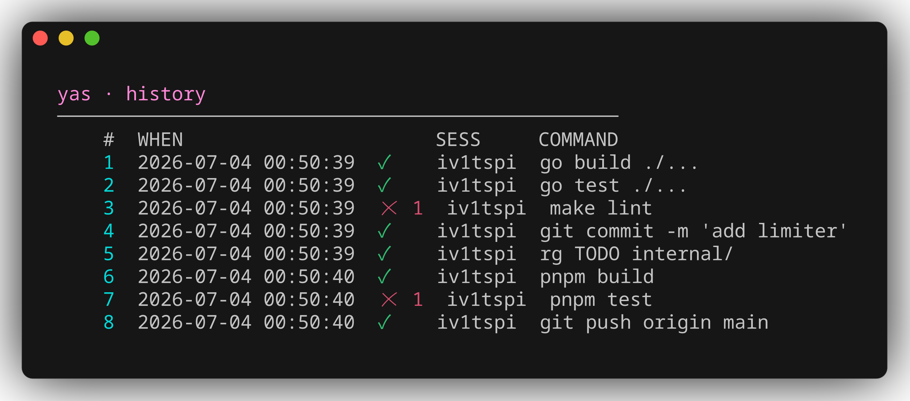
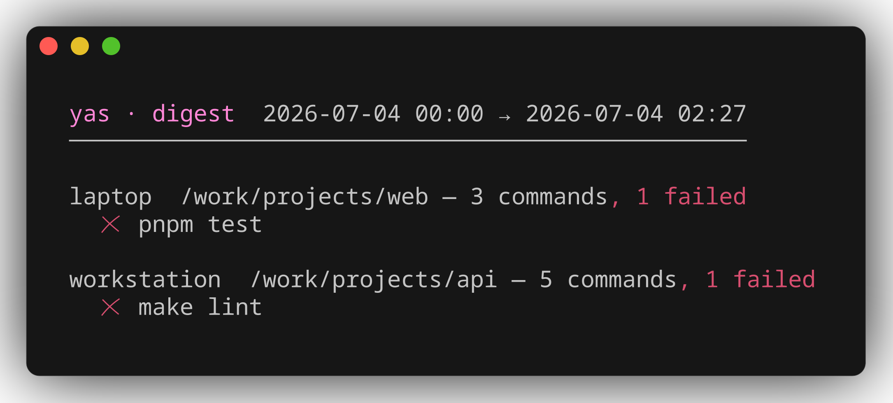
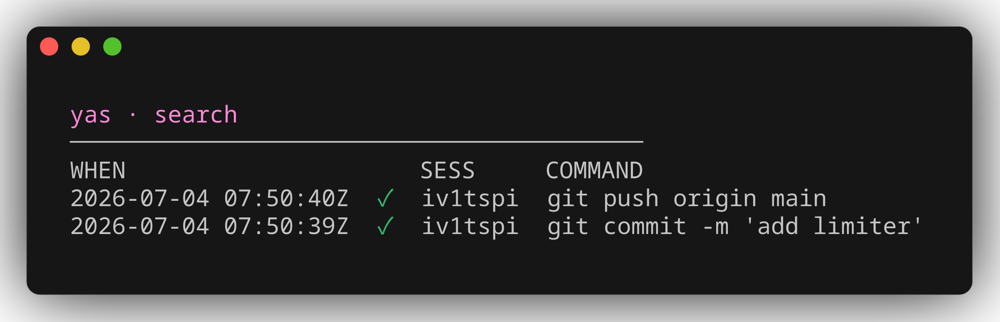

# yas shell history


**A queryable record of everything you run.** yas is a **local-first**
_execution substrate_: it records every command you run into a fast local
database, syncs it to a small central server, and exposes the data through a
stable **HTTP+JSON API** (plus a read-only **MCP** surface for agents) so you can bring —
or write — _any_ front-end: a CLI, `fzf`, a web dashboard, or a coding agent.
The richness, and the product itself, is the data and the contract, not a
bespoke interface. yas runs **no UI and no model of its own** — reasoning
(search, "what failed and why") lives in the client. Its one-line vision: **_own
the history API, not the history UI._** See the
[vision & direction spec](docs/superpowers/specs/2026-06-25-yas-vision-and-direction-design.md)
for the full positioning.

> **vs. atuin:** atuin is great but opinionated — it puts a full-screen TUI on
> `Ctrl-R` _and the up key_, ships its own sync-encryption model, stats, and a
> hosted-AI Hub. yas ships **no bundled UI and no model**: a recorder + a local
> store + a sync hub behind a documented JSON contract. The core never seizes
> your keys — the up key stays vanilla zsh, and `Ctrl-R` is whatever client you
> wire up (e.g. your existing `fzf` widget, now fed by yas across every
> machine).

## See it

**`yas history`** — recent commands, colorized by exit status (green ✓ / red ✗ with the code):



<details><summary>plain-text version</summary>

```text
    1  2026-07-04 00:34:15  [0]  iv1tspi  go build ./...
    2  2026-07-04 00:34:15  [0]  iv1tspi  go test ./...
    3  2026-07-04 00:34:15  [1]  iv1tspi  make lint
    4  2026-07-04 00:34:15  [0]  iv1tspi  git commit -m 'add limiter'
    5  2026-07-04 00:34:15  [1]  iv1tspi  pnpm test
    6  2026-07-04 00:34:15  [0]  iv1tspi  git push origin main
```

</details>

**`yas digest`** — today's commands grouped by host and git project (repo root,
falling back to directory), failures flagged:



**`yas search <term>`** — full-text search over the local replica:



<sub>Screenshots use synthetic demo data — regenerate with <code>make screenshots</code> (via <a href="https://github.com/charmbracelet/freeze">charmbracelet/freeze</a>).</sub>

## Non-goals

- **The core never seizes your keys or screen.** No _forced_ `Ctrl-R`/up-arrow
  hijack, no bundled TUI, no stats dashboards in core. The up key stays vanilla
  zsh; a `Ctrl-R` search client (your `fzf` widget, a TUI, …) is opt-in and is
  just another client of the contract. (Reference clients may live in
  `contrib/`.)
- **No model in core.** yas runs no inference; NL/semantic reasoning is the
  client's (or agent's) job. An optional out-of-process analytics/semantic
  sidecar is the only allowance, and never in the record path.
- No bespoke query DSL. Plain HTTP+JSON with obvious filters.
- Not a multi-tenant SaaS. Homelab scale: you + a handful of trusted machines.

## Architecture

```
┌─ each machine ──────────────────────────────┐         ┌─ homelab (once) ─────────┐
│  zsh hook ──► yas (CLI)  ──►  local SQLite  │         │  yas-server              │
│                │             (full replica) │         │     │                    │
│   yas serve ───┘──► localhost HTTP+JSON ◄─┐ │  HTTP/  │     ▼                    │
│       ▲                  query API        │ │  JSON   │   Postgres               │
│       │ your UIs (cli / tui / web / fzf)──┘ │◄─sync─► │   (source of record +    │
│                                             │         │    cross-machine merge)  │
└─────────────────────────────────────────────┘         └──────────────────────────┘
```

Two Go binaries, one repo:

- **`yas`** (agent, one per machine). The shell hook calls it to record each
  command directly into a local SQLite replica — synchronous and tiny, so it
  _works even when the server is down_. `yas serve` exposes a localhost
  **HTTP+JSON query API** over that replica: this is the surface your UIs
  target. A background `yas sync` pushes new local records to the server and
  pulls records from your other machines.

- **`yas-server`** (one per homelab). Postgres-backed. Serves only the **sync
  API** (push/pull) and is the durable merge point, so a fresh machine can
  backfill full history. Postgres is an implementation detail — never a public
  contract.

### Why these choices

| Decision        | Choice                          | Because                                                            |
| --------------- | ------------------------------- | ------------------------------------------------------------------ |
| Topology        | Local-first + sync              | Reads are local, instant, and offline. Server only merges.         |
| Language        | Go                              | One static binary per machine, trivial cross-compile, no runtime.  |
| Central store   | Postgres                        | Built for many networked clients; rich search; concurrent writes.  |
| Local store     | SQLite (FTS5)                   | One file, zero-ops, fast local search, perfect offline buffer.     |
| Client contract | HTTP+JSON only (schema private) | UIs never couple to a DB schema; we stay free to refactor storage. |

## Data model

A **record** is one command, captured at start and finalized when it completes.
Identity is a client-generated UUIDv7, which makes sync upserts idempotent
across machines. Fields known only after completion (`exit_code`, `duration_ms`)
are nullable. `deleted` is a tombstone so redactions propagate.

See [`internal/record/record.go`](internal/record/record.go) for the canonical
struct and [`internal/store/*/schema.sql`](internal/store) for storage.

## Query API — the UI contract

`yas serve` exposes a localhost HTTP+JSON API over the local replica. This JSON
surface — not the database schema — is the stable contract your UIs target.

**`GET /v1/search`** — matching records, newest-first by default:

| Param                    | Meaning                                                 |
| ------------------------ | ------------------------------------------------------- |
| `q`                      | full-text match (FTS5) over the command                 |
| `host`, `cwd`, `session` | exact-match filters                                     |
| `exit`                   | exact exit-code filter                                  |
| `executor`               | who/what ran it: a name, or `$all-agent` / `$all-human` |
| `since`, `until`         | RFC3339 time window (`since` ≤ start_time < `until`)    |
| `limit`, `offset`        | pagination (`limit=0` → server default)                 |
| `reverse`                | `true` for oldest-first                                 |

Response is `{"records": [ {record}, … ]}`. Malformed params → `400`; non-GET →
`405`. **`GET /v1/version`** → `{"version":"v1","record_fields":[…]}`. The full
record shape and stability promise are the
[v1 contract](docs/api/query-api-v1.md). **`GET /v1/healthz`** →
`{"status":"ok"}`.

```bash
yas serve --addr 127.0.0.1:8765 &
curl -s 'http://127.0.0.1:8765/v1/search?q=git&limit=20' | jq '.records[].command'
```

The built-in `yas search` is just another client of the same store:

```bash
yas search git --limit 20         # human-readable; flags may go before or after the text
yas search --json docker | jq .   # the same JSON envelope the API serves
yas search --failed               # only commands that exited non-zero
yas search --exit 130 vim         # filter by an exact exit code
yas search --no-session git       # hide the SESS token column
```

`yas history` mirrors the shell `history` builtin over the same replica —
oldest-first, numbered, newest at the bottom. Each line shows the command's
**SESS token** (a short 7-char per-shell identifier), its **result** (exit code;
`[-]` while still running), and its timestamp. Numbers are **absolute** (1 = the
oldest record ever, bash-style), so on a store with more than the shown entries
the listing starts well above 1:

```text
  148  2026-06-23 15:28:46  [0]    9bva8hl  git pull
  149  2026-06-23 15:29:07  [128]  9bva8hl  git checkout feat/mcp
  150  2026-06-23 15:34:01  [0]    d0mfaid  which yas
```

The **SESS column** is a compact display token derived from the full shell
session id (FNV-1a → base36, 7 chars, zero-padded). It lets you spot which
commands came from the same terminal session at a glance. The column is blank
for rows imported from `~/.zsh_history` or atuin (they carry no session id).
Use `--no-session` to suppress it entirely.

`history` is yas's default command: a bare `yas` and `yas <n>` are shortcuts
for `yas history` and `yas history <n>` (and a leading flag like `yas --json`
routes there too). Known subcommands and a bare unknown word are unaffected.

```bash
yas                               # shortcut for `yas history` (last 100)
yas 20                            # shortcut for `yas history 20`
yas history                       # last 100; numbered, with timestamp + result columns
yas history 20                    # just the last 20, keeping their absolute numbers
yas history --no-exit             # hide the result column
yas history --no-time --no-exit --no-session   # bare bash look (`<n>  <command>`)
yas history --no-session          # hide the SESS token column
yas history --json | jq .         # same envelope as the API (oldest-first; exit_code included)

yas history -d 42                 # delete the entry whose number is 42 in the listing
yas history -d 40-42              # delete a range, inclusive (endpoints same sign)
yas history -d -1                 # delete the newest (negative counts back from the newest)
yas history -c --yes              # delete ALL history (guard is mandatory)
```

`history` stays an unfiltered, delete-stable timeline (so `-d <n>` always
addresses the number shown); to _filter_ by result use `yas search --failed` or
`yas search --exit <n>`.

### Session view — one shell's linear history

`yas session` prints all commands from a single terminal session in
chronological (oldest-first) order, with a header line:

```bash
yas session 9bva8hl               # resolve by SESS token (as shown in search/history)
yas session hostZ-777-1751049600   # or pass the full session id directly
yas session demo-1 --no-time      # suppress timestamps
yas session demo-1 --json         # same JSON envelope as the API
```

```text
session 9bva8hl (hostZ-777-1751049600) · 2 commands
    1  2026-06-23 15:28:46  [0]    git pull
    2  2026-06-23 15:29:07  [128]  git checkout feat/mcp
```

(the result column shows by default, matching `history`; add `--no-exit` to
drop it)

(`which yas` above belongs to a different shell — token `d0mfaid` — so it
isn't part of this session.)

The SESS column is suppressed in this view (every row belongs to the same
session by definition). You can pipe to `grep` or `fzf` for lightweight
within-session search.

> **Live-only caveat:** rows imported from `~/.zsh_history` or atuin carry no
> session id. They show a blank SESS token in search/history and cannot be
> grouped by `yas session`. Only commands recorded by the yas zsh hook have a
> session id.

The human output of `search` and `history` is **colorized** (via Charm's
[lipgloss](https://github.com/charmbracelet/lipgloss), pure Go so the cgo-free
build still cross-compiles): the result is green for `[0]`, bold red for a
non-zero exit, yellow for a still-running `[-]`; the number and timestamp are
dimmed. Color is on for a terminal and turns itself off automatically when the
output is piped/redirected or `NO_COLOR` is set; `--no-color` forces it off.
`--json` is never colorized.

Deletions are tombstones, not hard deletes: `-d`/`-c` set the record's `deleted`
flag — a **sticky, monotonic** flag that **propagates to the server and every
other machine** on the next `yas sync` and never flips back, so a delete can't be
resurrected by a live write (e.g. a record-finish) racing it. (Bash's file-oriented
options — `-a/-n/-r/-w` — are just `yas sync` here; `-p`/`-s` are shell-side and
don't apply.)

### Pausing capture

With the zsh hook sourced, pause recording for the current shell — handy before
typing something you'd rather not keep:

```bash
yas-pause     # stop capturing in this shell
yas-status    # "tracking paused (this shell)" / "tracking active"
yas-resume    # start again
```

The pause is a per-shell variable, so it clears automatically when the terminal
exits; `export YAS_PAUSED=1` silences a whole terminal or a script.

### Importing existing history

Backfill the local store from history you already have — a zsh history file, or
an [atuin](https://atuin.sh) client database:

```bash
yas import                             # ~/.zsh_history (extended or plain format)
yas import --file /path/to/histfile    # another zsh history file
yas import --from atuin                # ~/.local/share/atuin/history.db
yas import --from atuin --file /path/to/history.db
```

Imports are idempotent: every entry gets a deterministic id derived from its
timestamp (floored to the second), host, and command, so re-running an import —
or importing the same event from both zsh history and atuin — upserts one row
instead of duplicating it. Entries the live hook already captured are skipped
(matched per host within ±1s). The atuin database is opened **read-only** (a
running atuin daemon is undisturbed); its rows keep the hostname recorded by
atuin — multi-machine databases import correctly — carry exit/duration only
when atuin knew them, and skip entries atuin has deleted. Imported rows have no
session id (see the live-only caveat above).

## Agent access (MCP)

`yas mcp` exposes your history to AI coding agents as **read-only** MCP tools
(`search_commands`, `recent_commands`, `what_failed`, `command_status`, plus the
curated `failure_summary` rollup and `how_did_i_run` recall) — the
same records your Ctrl-R recall hits, queried through the same contract. It's
the agent seam to the human seam's fzf Ctrl-R. Add it with
`claude mcp add yas -- yas mcp` (stdio), or serve StreamableHTTP with
`yas mcp --http 127.0.0.1:8770`. See [docs/mcp.md](docs/mcp.md).

## Sync protocol (deliberately boring)

Records are append-mostly events; the only mutations are "finish" fields
(last-writer-wins by `id`) and tombstones (monotonic by `id` — delete wins over
any later live write). No CRDT needed.

- **Push** — `POST /v1/sync/push` with records the server hasn't acked. The
  server upserts by `id` and assigns each row a monotonic `seq`.
- **Pull** — `GET /v1/sync/pull?since=<seq>&limit=<n>`. The client tracks its
  `last_pulled_seq`, applies upserts into local SQLite, and advances the cursor.
  Any change to a row bumps its `seq`, so finalized/redacted records re-pull.

`seq` is server-internal and never appears in the record JSON.

## Security (homelab posture)

- A static **bearer token** per machine guards the sync API (v1). Run behind TLS
  / Tailscale. Pluggable later if you outgrow it.
- **Redaction**: `ignore_patterns` in the client config drop sensitive commands
  before they're ever written locally.

## Status & roadmap

**Working today:** live zsh capture, local FTS5 search, session views,
sync to a central Postgres, the `/v1` query API, the `yas digest` cross-stream
synthesis, MCP access for agents (including the first curated `failure_summary`
rollup and `how_did_i_run` recall verbs), zsh-history/atuin import, and static
cross-compiled release builds.

**Next:** cross-tool correlation — populating the reserved `corr_id` field so
a recorded command can join to the agent session that ran it — and further
curated MCP recall verbs as dogfooding surfaces them. See the
[vision & direction spec](docs/superpowers/specs/2026-06-25-yas-vision-and-direction-design.md).

Stretch: bash + fish hooks; optional global query API on the server for a
homelab-wide web dashboard; per-record redaction UI.

## Dev quickstart

```bash
go build ./...        # builds both binaries
go test ./...
```

## Install

```bash
make install         # cgo-free static `yas` -> ~/.local/bin, version stamped
yas version         # -> e.g. "yas v0.1.0" or "yas 9284633"
```

See [BUILD.md](BUILD.md) for the build/test targets, the cgo-free invariant,
cross-compiling, version stamping (and the `main.version` gotcha), and releases.

### Shell completion

`yas completion <shell>` prints a completion script, in the same shape as
`kubectl`/`gh`/`atuin`. Only zsh is supported for now (matching the capture
hook). Either install it on `$fpath`:

```bash
yas completion zsh > "${fpath[1]}/_yas"   # any directory on $fpath works
```

or source it from `.zshrc` (after `compinit` runs):

```bash
source <(yas completion zsh)
```

It completes subcommands, per-command flags, and enum values like
`import --from zsh-history|atuin`.
